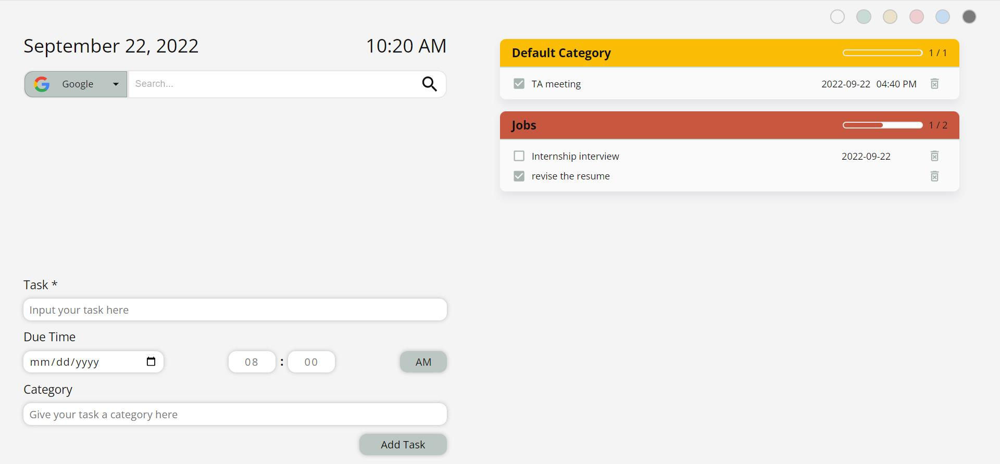

# Extension for Chrome/Edge: To-Do Tab

This is a web extension that overrides the new tab page with a **cleaner UI** and a **to-do list component**. For users who often use browsers during working and studying, this web extension can encourage them to frequently review and update their to-do lists.

Compatible with **Chrome** and **Microsoft Edge**.

## Preview

## Features

- Switching search engines: Google, Microsoft Bing, Stack Overflow, DuckDuckGo, Baidu
- A search bar
- Add, delete, and edit tasks
- Make a to-do list and categorize the tasks
- Notifications of tasks
- Customize the background color of the new tab page

## How to Use

Open the terminal and navigate to this repository folder, then run:
`npm install`

After installing the packages, run:
`npm run build`

After creating a build folder, open the web browser and go to the extensions page, enable the developer mode, and click "load unpacked".

Load the build folder and enable this extension. Open a new tab page and if there is a pop window asking whether you want the extension changes your new tab page, please let it keep the changes. You will see a to-do tab now!
